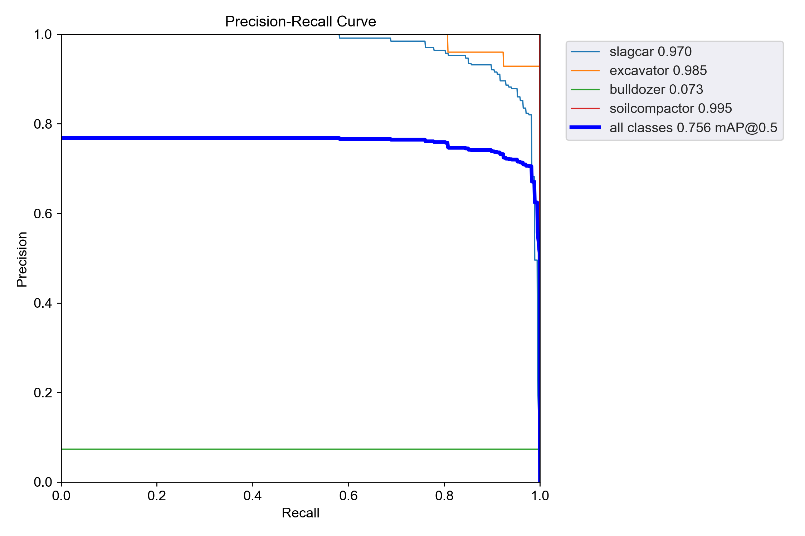
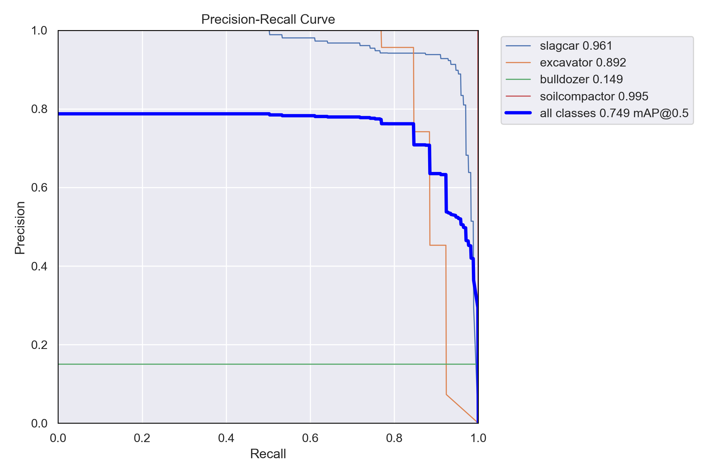

# YOLOv5 Model
## 介绍
本仓库基于YOLOv5模型，用于保存HUST_AIA计算机视觉课设的代码。YOLOv5模型是[Ultralytics](https://www.ultralytics.com/)公司提出的一个高效目标分类模型，原代码链接位于[github仓库](https://github.com/ultralytics/yolov5),关于它的介绍就不再赘述
## 使用方法
### 准备环境
使用[miniconda(推荐)或者anaconda](https://docs.conda.io/projects/conda/en/stable/user-guide/install/download.html#anaconda-or-miniconda)进行环境配置。

首先安装[conda](https://www.anaconda.com/download/)或者[miniconda](https://docs.conda.io/en/latest/miniconda.html),然后依次运行如下代码
```
conda create -n yolov5 python=3.8
conda activate yolov5
pip install -r requirements.txt
```
### 准备数据集
首先需要将老师提供的数据集放在[yolov5/data](data/)文件夹下,并按照如下方式进行组织：
```
dataset
|- images
|- labels
|- classes.txt
|- train_det_data.json
|- val_det_data.json
```
其中，[train_det_data.json](../retinanet/Dataset/annotations/train_det_data.json)和[val_det_data.json](../retinanet/Dataset/annotations/val_det_data.json)为队友分割的测试和训练标签的coco格式json文件，需要自行加入。

根据train_det_data.json和val_det_data.json，我们可以运行代码`python split_dataset_fromjson.py`生成yolov5需要的文件格式，即在images和labels里面各自拆分训练和测试数据，并得到如下数据集组织结构:
```
dataset
|- images
|   |- train
|   |- test
|- labels
|   |- train
|   |- test
|- classes.txt
|- train_det_data.json
|- val_det_data.json
```
### 训练模型
运行如下代码
```
python train.py
```
其中，可以更改train.py中的config, cfg, data, hyp, batch-size, imgsz等参数，其中，当前的参数对应我本地环境：
```
OS: Ubuntu 22.04.3LST
NVIDIA driver: 535.113.01
CUDA version:12.2
NVIDA GeForce GTX TITAN X
```
### 验证模型
运行代码
```
python val.py
```
### 验证效果
当采用[yolov5m6.yaml](models/hub/yolov5m6.yaml)配置文件进行网络参数的配置，载入预训练模型[yolov5m6.pt](yolov5m6.pt),采用中等数据增强超参数[hyp.scratch-med.yaml](data/hyps/hyp.scratch-med.yaml)得到的训练效果
| Class | Images | Instances | P | R | mAP<sub>50</sub> | mAP<sub>50-95</sub> 
| -- | -- | -- | -- | -- | -- | -- |
| all | 41 | 197 | 0.96 | 0.475 | 0.756 | 0.593 |
| slagcar | 41 | 167 | 0.928 | 0.898 | 0.97 | 0.724 |
| excavator | 41 | 26 | 0.913 | 1 | 0.985 | 0.712 |
| bulldozer | 41 | 3 | 1 | 0 | 0.0728 | 0.0401 |
| soilcompactor | 41 | 1 | 1 | 0 | 0.995 | 0.895 |

训练的的PR-curve如下图所示：


当采用高数据增强超参数[hyp.scratch-high.yaml](data/hyps/hyp.scratch-high.yaml)得到的训练效果
| Class | Images | Instances | P | R | mAP<sub>50</sub> | mAP<sub>50-95</sub> 
| -- | -- | -- | -- | -- | -- | -- |
| all | 41 | 197 | 0.973 | 0.433 | 0.749 | 0.566 |
| slagcar | 41 | 167 | 0.937 | 0.888 | 0.961 | 0.676 |
| excavator | 41 | 26 | 0.956 | 0.845 | 0.892 | 0.487 |
| bulldozer | 41 | 3 | 1 | 0 | 0.149 | 0.107 |
| soilcompactor | 41 | 1 | 1 | 0 | 0.995 | 0.995 |

训练的的PR-curve如下图所示：
